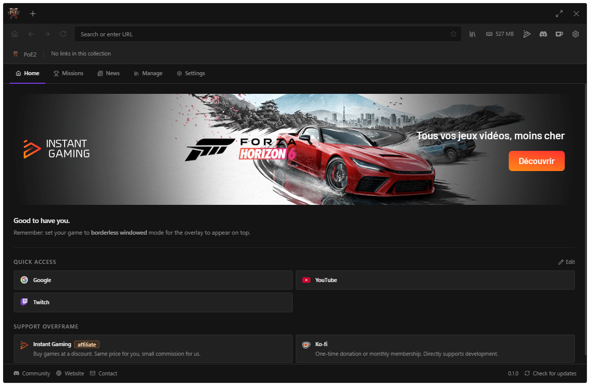
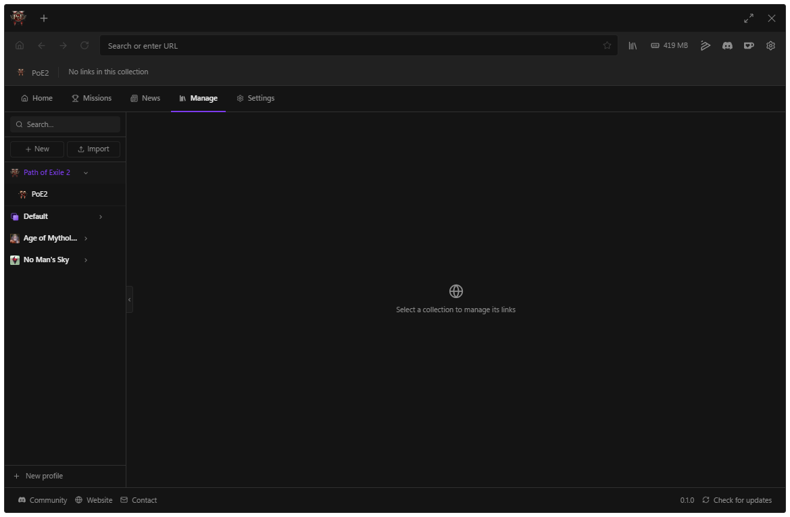

# Overframe

Free, open-source browser overlay for PC gamers. Press `Alt+B` to open a browser on top of any borderless game — no alt-tab, no injection, no anti-cheat risk.

**[overframe.app](https://overframe.app) · [Releases](https://github.com/overframeApp-arch/Overframe/releases) · Windows 10/11**



## Features

- Always-on-top Chromium browser overlay
- Configurable global hotkey (default `Alt+B`)
- Click-through mode — mouse passes to the game when overlay is unfocused
- Per-game profiles with auto-detection (process name)
- Per-tab zoom memory and live memory profiler
- Performance Mode — frees GPU/RAM when overlay is hidden
- Keyboard layout support: AZERTY, QWERTY, DVORAK
- No code injection — safe by design

## Tech Stack

| Layer | Technology |
|---|---|
| Shell | Electron |
| UI | React + Tailwind CSS |
| Web renderer | Microsoft Edge WebView2 (native addon, one process per tab) |
| Storage | electron-store (profiles/collections/settings) + better-sqlite3 (history) |
| Build | electron-vite + electron-forge |
| Installer | Squirrel.Windows (`Overframe-Setup.exe`) |
| Language | TypeScript |

## Install

1. Download `Overframe-Setup.exe` from the [Releases page](https://github.com/overframeApp-arch/Overframe/releases/latest).
2. Run the installer. Windows SmartScreen will warn because the binary is not
   yet code-signed — click **More info → Run anyway**.
3. Overframe starts in the system tray. Press **`Alt+B`** over any borderless
   windowed game to toggle the overlay.

## Usage

| Action | Shortcut |
|---|---|
| Show / hide overlay | `Alt+B` (configurable) |
| New tab | `Ctrl+T` |
| Close active tab | `Ctrl+W` |
| Focus address bar | `Ctrl+L` |
| Drag the window | Drag the strip at the top |
| Click-through mode | Click outside the chrome |

Game profiles live in **Settings → Game profiles**. Add the process name
(e.g. `eldenring.exe`) and Overframe auto-switches profile when that game is
running.

Link collections keep your builds, guides and wikis one click away, per game:



## FAQ

**Windows says "Windows protected your PC" — is this safe?**
The installer is not code-signed yet (certificates cost several hundred euros a
year), so SmartScreen shows a warning for any new unsigned app. The code is
open source — you can read every line. Click **More info → Run anyway**.

**Will this get me banned by anti-cheat?**
Overframe never touches the game. It is a regular always-on-top window — no
code injection, no memory reading, no DLL hooks, nothing an anti-cheat scans
for. It is the same mechanism as a second monitor showing a browser. That said,
if a game's rules worry you, check them — we cannot speak for every publisher.

**The overlay doesn't show above my game.**
Your game must run in **borderless windowed** (or windowed) mode. In exclusive
fullscreen, Windows lets the game bypass the desktop compositor, so no window
can appear above it. Most modern games offer borderless windowed in their video
settings.

**Does Overframe block ads?**
Not at the moment. The ad blocker we shipped (uBlock Origin) stopped working
when Microsoft Edge removed Manifest V2 extension support in mid-2026 — this
affects every Edge-based app. Edge's built-in tracker protection still runs. A
replacement is on the roadmap.

**Where is my data stored?**
Everything stays on your machine (`%LOCALAPPDATA%\Overframe`). No account, no
telemetry, no analytics.

## Develop

```powershell
pnpm install        # installs deps + compiles native sqlite binding
pnpm dev            # electron-vite dev server
pnpm build          # production bundle → out/
pnpm make           # build + package installer → dist/
pnpm typecheck      # type-check main + renderer
pnpm test           # vitest unit tests
```

Requires **Node 20+** and **pnpm 10+**. `better-sqlite3` compiles at install
via `node-gyp` — needs **Visual Studio Build Tools** on Windows.

